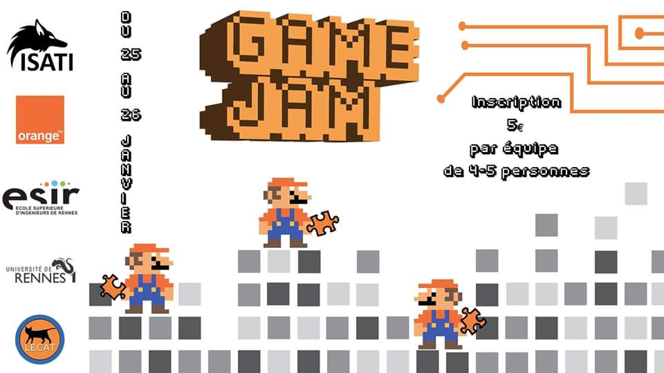
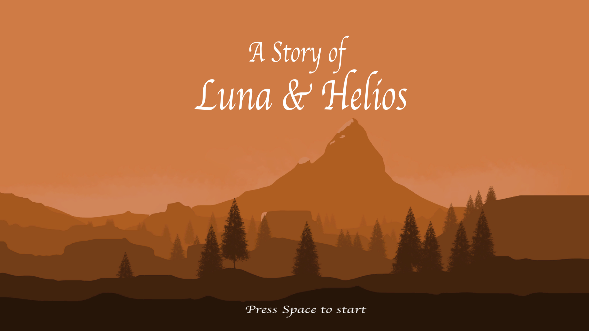
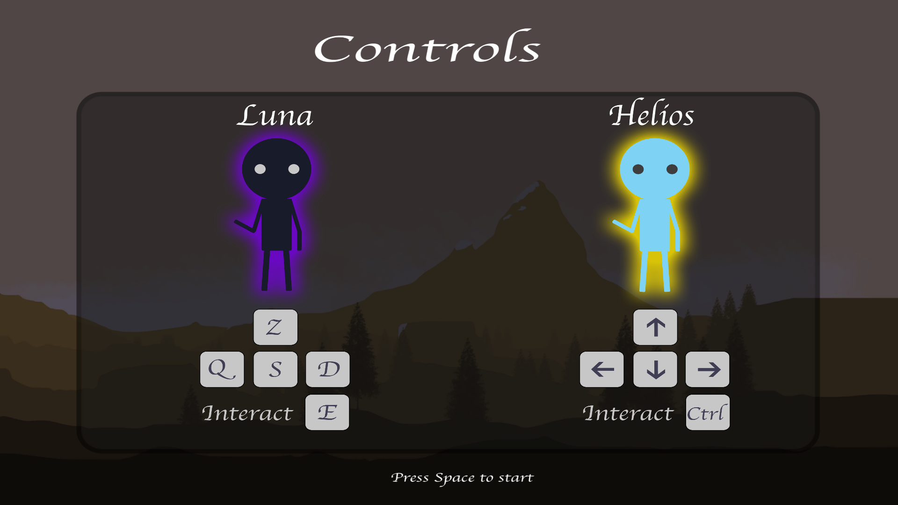
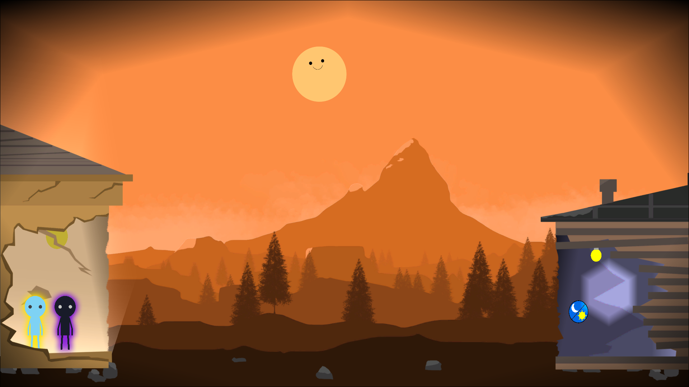
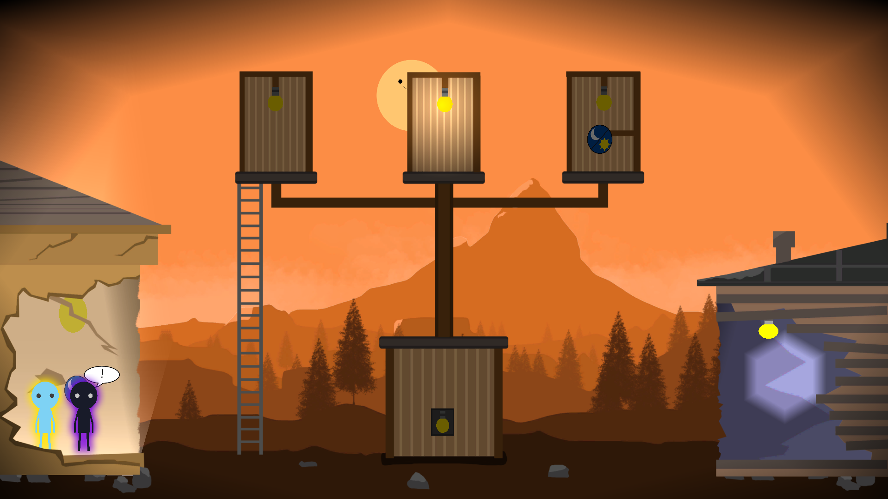
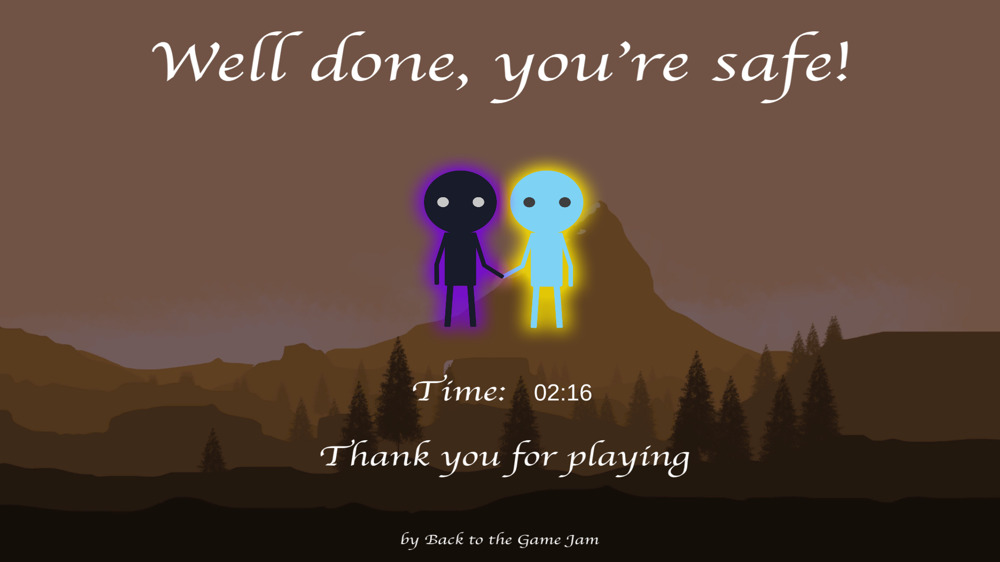

# A Story of Luna & Helios
**Designed on Unity 2019.2.19f1**

This game has been released during the **Game Jam 2020**. The aim of this event was to build a video game in 35 hours on the subject : **Safe in the dark**

*Youtube Gameplay*

## Members

|  |  |  |  |  | 
|:-:|:-:|:-:| :-:| :-:| 
| [Matthias PINARD](https://github.com/Nassafy) | [Vincent BERTHET](https://github.com/RealVincentBerthet) | [Tugdual LE PEN](https://github.com/Tuckdu) | [Paul LE TAMBOUR](https://github.com/PandoS0CE) | [Benoit Quero](https://github.com/benoitquero) | 
| Developer | Developer | Handballer | Game and sound designer | Graphic Designer |

## Story

"One day, two beautiful twins were born, Helios and Luna. Unfortunately soon after their birth, they discovered that Luna was a child of the moon with a hyper-sensitivity to the sun's rays that can lead to death. Helios was diagnosed as a nyctophobe, an extreme phobia of the dark that can lead to death. Forced to live locked up with only artificial light, they grew up cut off from the outside world, which bound them in such a strong relationship that they could read each other's thoughts. As a result, they were always equal to stone, leaf, chisel. One day, they heard about two relics, which would allow them to blossom in the outside world. Neither one nor two, they set out on an adventure"  *- Tugdual LE PEN*

## Screenshots

*Press F1 to skip a level*
|  |  |  |
|:-:|:-:|:-:|
|Home|Rules|Level 1|
| |  |   |
|Level 2|Level 3| End|
